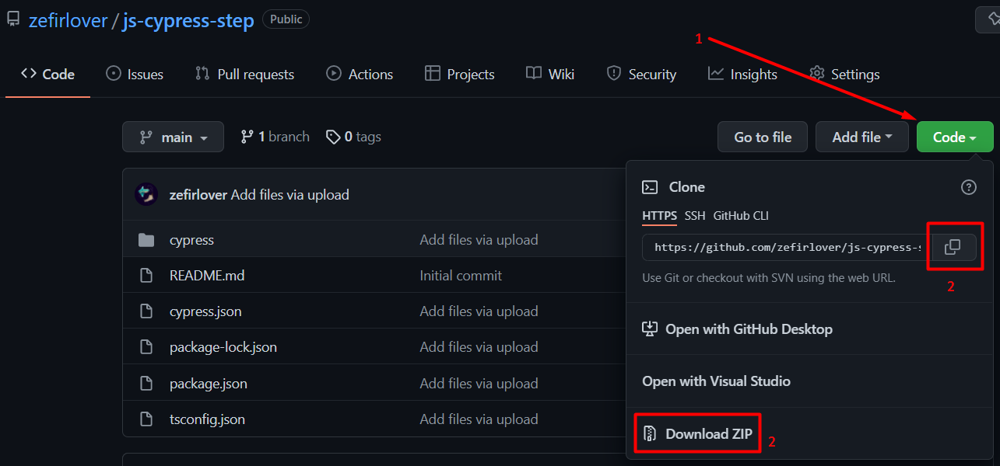

# js-cypress-step
JavaScript Cypress automation tests created to test authorisation
and appearance of the tabs in the "step" application.
#### What is the "step" application?
"step" is a unified platform for software automation that allows you to make
the most out of automation artifacts while getting rid of specific tools.
More information you can get here: https://step.exense.ch/knowledgebase/3.18/
### Project installation
You need to install a Node.js LTS:
Using this reference: https://nodejs.org/en/

Then, you can download the project.
Click the "code" button. You can download ZIP archive or use the `git clone`
command.

After that open the command prompt in the project folder and run the
`npm install`, and then execute the `npm i cypress typescript --save-dev` command.

To get more info about Cypress you can use this link:
https://docs.cypress.io/guides/getting-started/installing-cypress#Environment-variables

### How to start your tests
To run the tests you can use the `npx cypress run` command or if you want to open
the Cypress UI you can use the `npx cypress open` command. Please, be sure that
your npx is installed. It can be pre-installed with npm > v.5.2 or installed separately.

To get more variants to start your cypress tests or more information about cypress
visit this page: https://docs.cypress.io/guides/getting-started/installing-cypress#Opening-Cypress