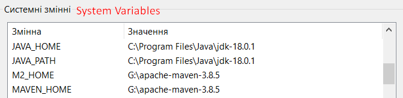
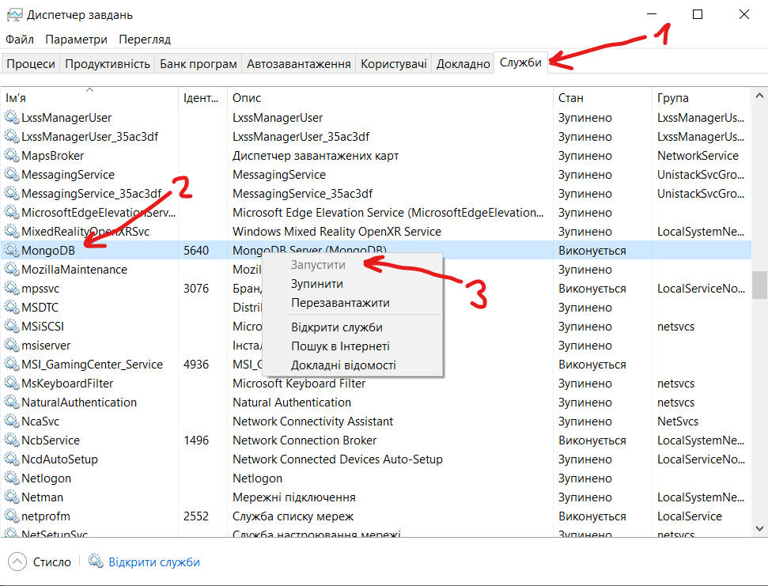
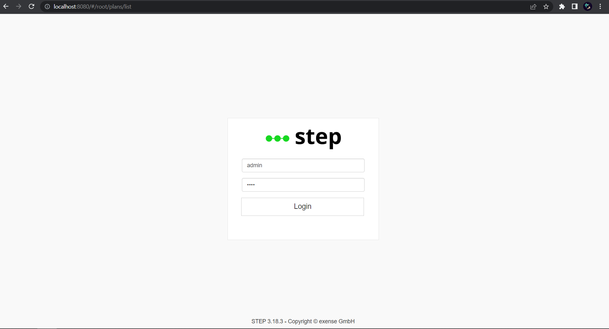
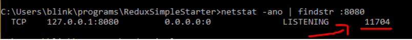

# js-cypress-step
JavaScript Cypress automation tests created to test authorisation
and appearance of the tabs in the "step" application.
#### What is the "step" application?
"step" is a unified platform for software automation that allows you to make
the most out of automation artifacts while getting rid of specific tools.
More information you can get here: https://step.exense.ch/knowledgebase/3.18/

### "step" installation
First, you need to install the actual Java Development Kit (18 or above) from here:
https://www.oracle.com/java/technologies/downloads/#java18. Be aware about the environmental
variables!
Also, add the java home path to the Path variable.

Second, you need to install the Community MongoDB Server from here:
https://www.mongodb.com/try/download/community

Download the `agent` and the `controller` from here:
https://github.com/exense/step/releases/latest

Unzip both step archives. There should be a controller folder and an agent folder.
Run through the default steps of MongoDB’s installation wizard, using the default port.
Choose to install the MongoDB Compass from the installation wizard mentioned before.

### Start the "step"
Open the MongoDB Compass and click green `Connect` button. If you have an error in
process, tap the `Ctrl + Shift + Esc`, go to the `Services` tab, find the MongoDB process,
click `Right Mouse Button` on it and click `Run`:

Then, go to the step controller folder, `bin/startController.bat` and run it.
Optionally, you can run the step agent from `'step-agent-folder'/bin/startAgent.bat`.
After that go to the `localhost:8080`. If everything is okay, you will see this page:

If you see anything else, that means you need to terminate controller and agent,
open the command prompt in administrator mode and use the `netstat -ano | findstr :8080`.
Then the pid will appear at the right which you can kill with taskkill.

Use the `taskkill /pid 11704 /F` command and start controller and agent again.

Note: login: admin and password: init are default values.

### Project installation
You need to install a Node.js LTS:
Using this reference: https://nodejs.org/en/

Then, you can download the project.
Click the "code" button. You can download ZIP archive or use the `git clone`
command.

After that open the command prompt in the project folder and run the
`npm install`, and then execute the `npm i cypress typescript --save-dev` command.

To get more info about Cypress you can use this link:
https://docs.cypress.io/guides/getting-started/installing-cypress#Environment-variables

### How to start your tests
To run the tests you can use the `npx cypress run` command or if you want to open
the Cypress UI you can use the `npx cypress open` command. Please, be sure that
your npx is installed. It can be pre-installed with npm > v.5.2 or installed separately.

To get more variants to start your cypress tests or more information about cypress
visit this page: https://docs.cypress.io/guides/getting-started/installing-cypress#Opening-Cypress